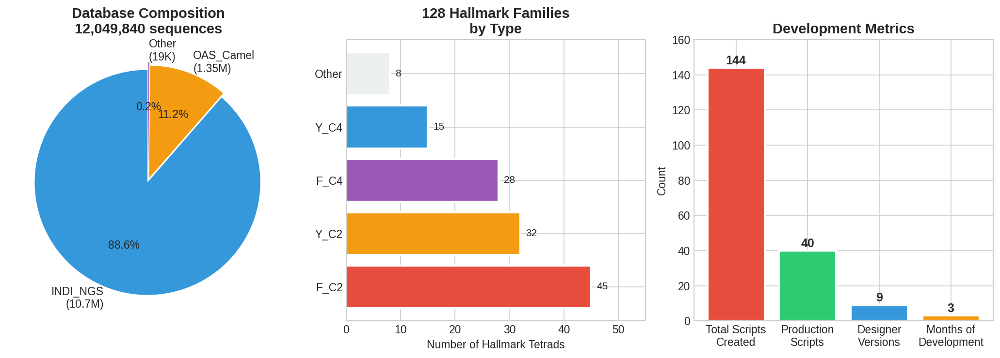
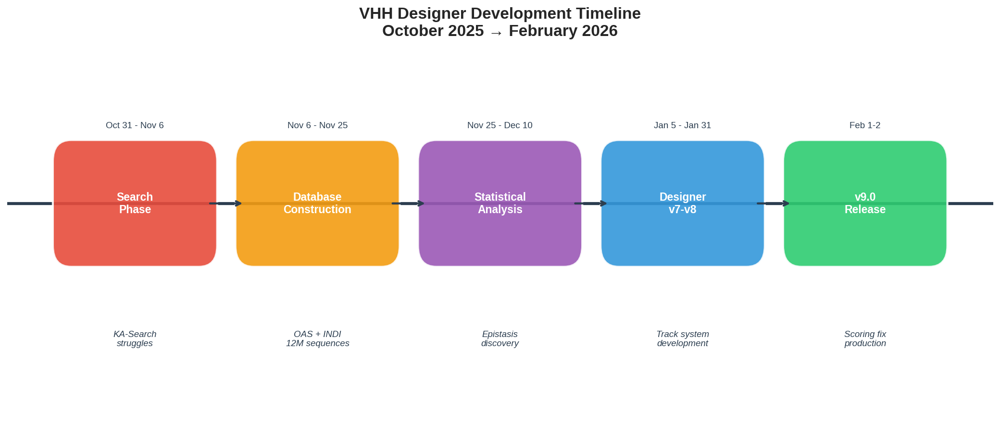
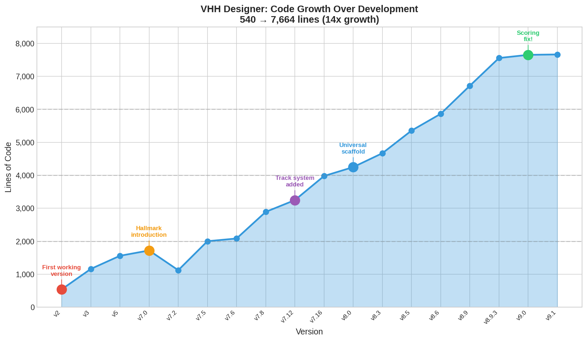
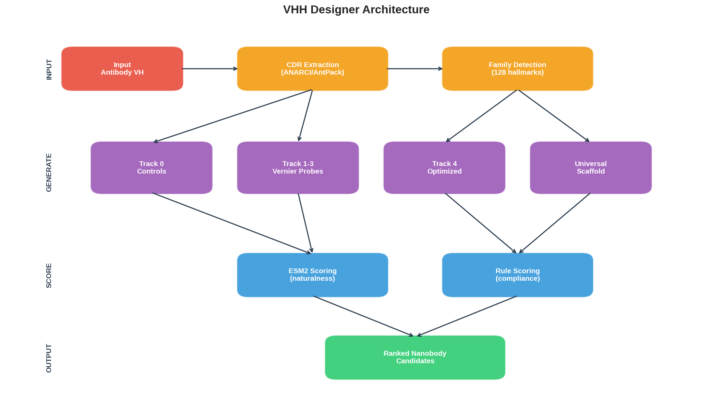

# VHH Designer - Development Log

> **A 3-month journey from database searches to generative protein design**  
> October 2025 → February 2026

---

## Executive Summary

| Metric | Value |
|--------|-------|
| **Total Development Time** | ~3 months |
| **Final Codebase** | 7,664 lines (core designer) |
| **Database Curated** | 12,049,840 VHH sequences |
| **Hallmark Families Discovered** | 128 unique tetrads |
| **Major Versions** | 9 (v1 → v9) |
| **Key Insight** | CDR-framework coupling is hallmark-specific |



---

## Timeline Overview



---

## Phase 1: The Search Era (Oct 31 - Nov 6, 2025)

### Goal
Find existing human antibodies with similar CDR3 to use as humanization templates.

### Key Scripts
| Script | Lines | Purpose |
|--------|-------|---------|
| `kasearch_epitope_ranker.py` | 349 | Initial KA-Search wrapper |
| `kasearch_epitope_ranker_fixed.py` | 568 | Memory fixes |
| `kasearch_epitope_ranker_robust.py` | 613 | Stable production version |

### Challenges Overcome
- ❌ `keep_best_n=100,000` crashed → Fixed with conservative caps
- ❌ Searched Light chains instead of Heavy → Path debugging
- ❌ ANARCI unpacking errors → Tuple handling fix
- ❌ Metadata fetching timeouts → Disabled by default

### Insight
> *"Finding similar sequences doesn't solve the conversion problem—I need to understand WHY certain framework mutations accompany certain CDRs."*

---

## Phase 2: Database Construction (Nov 6 - Nov 25, 2025)

### Goal
Build a comprehensive VHH sequence database with proper IMGT annotation.

### Key Scripts
| Script | Lines | Purpose |
|--------|-------|---------|
| `build_camel_vhh_db.py` | 715 | OAS camel translation pipeline |
| `npz_fullscan_v2.py` → `v6.py` | 393→1060 | Database scanner evolution |
| `annotate_all_shards_v1.py` → `v8.py` | 829→651 | IMGT annotation (refined) |

### Database Sources Integrated
| Source | Sequences | Notes |
|--------|-----------|-------|
| INDI_NGS | 10,675,894 | Llama, alpaca, camel repertoires |
| OAS_Camel | 1,354,537 | Required NT→AA translation |
| INDI_patent | 14,356 | Has target annotations |
| SAbDab_PDB | 1,559 | Crystal structures |
| Other | ~3,494 | Manual, GenBank, therapeutic |
| **Total** | **12,049,840** | Deduplicated |

### Key Discovery
> *OAS amino acid sequences were truncated. Had to translate from nucleotides to get full-length VHH sequences.*

---

## Phase 3: Statistical Analysis (Nov 25 - Dec 10, 2025)

### Goal
Discover CDR-framework correlations that govern VHH structure.

### Key Scripts
| Script | Lines | Purpose |
|--------|-------|---------|
| `analyze_cdr_framework_correlations.py` | 490 | Initial correlation search |
| `vhh_epistasis_overnight_v1.py` | 1,193 | Large-scale epistasis |
| `vhh_epistasis_overnight_v2.py` | 1,262 | Position mapping fix |
| `vhh_naturalness_analyzer_v1.py` → `v4.py` | 915→995 | ESM2 integration |

### Discoveries
1. **223 high-confidence CDR3↔framework correlations**
2. **Positions 66-73 (vernier zone) form a control hub**
3. **Position 50 (L→R) predicts CDR3 charge** (2x more charged with L)
4. **Epistatic pairs**: A68-M91 (65%), V71-I78 (76%), G47-G52 (97%)

### Key Insight
> *"CDR3 is NOT structurally independent—it has extensive coupling with framework positions. Simple CDR grafting without considering these correlations will fail."*

---

## Phase 4: Hallmark Discovery (Dec 10 - Jan 5, 2026)

### Goal
Classify VHH families and extract family-specific rules.

### Key Scripts
| Script | Lines | Purpose |
|--------|-------|---------|
| `vhh_compensation_imgt_v1.py` → `v6.py` | 476→318 | Rule extraction |
| `convert_epistasis_to_designer.py` | 603 | Rules → JSON |
| `vhh_analysis_unified_v7.py` | 1,058 | Combined analysis |

### The Hallmark Tetrad System
| Position | Human VH | Classic VHH | Function |
|----------|----------|-------------|----------|
| IMGT 42 | V | F or Y | Fills VL cavity |
| IMGT 49 | G | E, Q, K | Solubility |
| IMGT 50 | L | **R** | **Critical** - solubility |
| IMGT 52 | W | G, A, L, F | VL contact removed |

### Family Classification
- **128 unique hallmark combinations** discovered
- **F_C2, F_C4, Y_C2, Y_C4** = major families
- **C2/C4** = cysteine architecture (2 vs 4 disulfides)

### Key Insight
> *"Vernier zone mutations are hallmark-specific. FERG verniers ≠ YQRL verniers. You can't apply generic 'VHH rules'—you must respect which family you're targeting."*

---

## Phase 5: Designer v7 Series (Jan 5 - Jan 20, 2026)

### Goal
Build the first generation-capable VHH designer.

### Evolution
| Version | Lines | Key Addition |
|---------|-------|--------------|
| v7.0 | 1,721 | Basic hallmark mutation |
| v7.1 | 1,721 | Rule file loading |
| v7.2 | 1,122 | ESM2 scoring integration |
| v7.4 | 1,937 | ESMFold structure prediction |
| v7.5 | 2,001 | Combined scoring pipeline |
| v7.6 | 2,083 | Family-aware selection |
| v7.7 | 2,491 | Weighted hallmark+vernier matching |
| v7.8-v7.9 | 2,915 | Multi-family generation |
| v7.10-v7.12 | 3,247 | Track system prototype |
| v7.13-v7.16 | 3,978 | Track system finalized |

### The Track System (v7.12+)
| Track | Name | Purpose | Ranking |
|-------|------|---------|---------|
| 0 | Minimal Hallmark | Baseline controls | Exempt |
| 1 | Single Vernier | Probe individual positions | Exempt |
| 2 | Paired Vernier | Test position pairs | Exempt |
| 3 | Triplet Vernier | High-confidence triplets | Exempt |
| 4 | Optimized | Full consensus + diversity | Ranked |

### Key Insight
> *"YQRL has 0 variable verniers—it's the most constrained scaffold. Need separate 'scientific probe' controls vs 'optimized candidates'."*

---

## Phase 6: Designer v8 Series (Jan 21 - Jan 31, 2026)

### Goal
Production-ready designer with robust C2/C4 handling.

### Evolution
| Version | Lines | Key Addition |
|---------|-------|--------------|
| v8.0 | 4,248 | Universal scaffold support |
| v8.1-v8.2 | 4,420 | Two-lane Track 4 (original + universal) |
| v8.3 | 4,669 | MSA output integration |
| v8.4-v8.5 | 5,355 | YQRL-specific handling |
| v8.6 | 5,863 | Enhanced family selection |
| v8.8 | 5,966 | Cysteine position validation |
| v8.9 | 6,715 | Cross-track deduplication |
| v8.9.1-v8.9.3 | 7,556 | Hallmark diversity caps |
| v8.9.4 | 7,599 | MSA-compatible ID format |

### Critical Bug Fixed (v8.8)
```python
# BEFORE (wrong): Classification by cysteine COUNT
c_label = "C4" if cys_count >= 4 else "C2"

# AFTER (correct): Classification by IMGT POSITIONS
c55 = positions.get(55) == 'C'
c100 = positions.get(100) == 'C'
c_label = "C4" if (c55 and c100) else "C2"
```

---

## Phase 7: Designer v9 - Current Release (Feb 1-2, 2026)

### Goal
Fix scoring direction bug, finalize for production.

### Evolution
| Version | Lines | Key Change |
|---------|-------|------------|
| v9.0 | 7,652 | **CRITICAL: Scoring direction fix** |
| v9.1 | 7,664 | Minor refinements |

### The Scoring Bug (v9.0)
```python
# BEFORE (v8.x - INVERTED!):
# Higher rule compliance → WORSE rank (wrong!)

# AFTER (v9.0 - CORRECT):
# Higher rule compliance → BETTER rank
# Lower ESM2 loss → BETTER rank
# Higher pLDDT → BETTER rank
```

### Final Architecture
- **103 functions**, **12 classes**
- **7 default hallmarks**: FERG, FERF, YQRL, FERA, YERL, FKRG, FQRA
- **5-track generation system**
- **6-phase selection pipeline**
- **Cross-track deduplication**
- **Hallmark diversity cap** (35% max per hallmark)

---

## Supporting Tools Evolution

### NPZ Scanner (Database Search)
```
v2 (Nov 3)  → v3 (Nov 3)  → v5 (Nov 4)  → v6 (Nov 5)  → v6_integrated (Jan 2)
   393 lines    446 lines    521 lines    930 lines      1,060 lines
   
Basic scan → Bugfixes → Interactive → Improved org → Full integration
```

### Shard Annotator (IMGT Numbering)
```
v1 (Jan 4)  → v2 (Jan 6)  → v4-v5 (Jan 6) → v6-v7 (Jan 6) → v8 (Jan 7)
   829 lines    869 lines    586 lines       643 lines       651 lines
   
Initial → Refinement → Simplification → Fixes → Production
```

### MSA Visualizer
```
v7 (Jan 31) → v7_imgt (Feb 1) → v8 (Jan 31) → v8_imgt (Jan 31)
  1,032 lines   1,176 lines      945 lines     1,165 lines
  
AntPack → IMGT labels → Simplified → IMGT + simplified
```

---

## Lines of Code Growth



---

## System Architecture



---

## Key Files Summary

### Production Scripts (Keep)
| File | Lines | Purpose |
|------|-------|---------|
| `vhh_designer_v9_1.py` | 7,664 | **Main product** |
| `npz_fullscan_v6_integrated.py` | 1,060 | Database scanner |
| `annotate_all_shards_v8.py` | 651 | IMGT annotation |
| `vhh_epistasis_overnight_final.py` | 1,193 | Epistasis extraction |
| `vhh_naturalness_analyzer_v4.py` | 995 | ESM2 scoring |
| `align_vs_lead_v8_imgt.py` | 1,165 | MSA visualization |
| `vhh_analysis_unified_v7.7.py` | 1,520 | Combined analysis |

### Data Files (Required)
| File | Purpose |
|------|---------|
| `analysis_rules_v7_all_positions.json` | Position-specific rules |
| `analysis_vernier_archetypes_v7.json` | Family archetypes |
| `comprehensive_subfamily_analysis_imgt.xlsx` | Hallmark database |
| `VHH_db_final.npz` | 12M sequence database |

---

## Lessons Learned

1. **Start with data understanding** - The OAS truncation issue cost weeks
2. **Validate assumptions** - Position 50 L→R was assumed, then verified
3. **Family-specific rules matter** - Generic "VHH" rules don't work
4. **Scoring direction matters** - The v9 bug ranked everything backwards
5. **Controls ≠ candidates** - The track system solved YQRL paradox
6. **Iterative refinement works** - 40+ versions of the designer

---

## What's Next

- [ ] Wet-lab validation of v9 designs
- [ ] Integration with structure predictors (AlphaFold/ESMFold)
- [ ] Multi-target design support
- [ ] Web interface for non-programmers

---

*Last updated: February 3, 2026*
