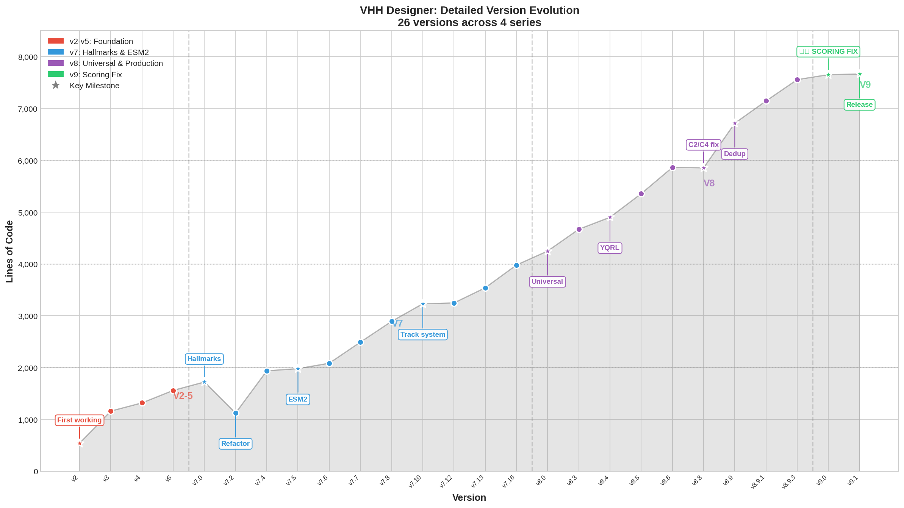
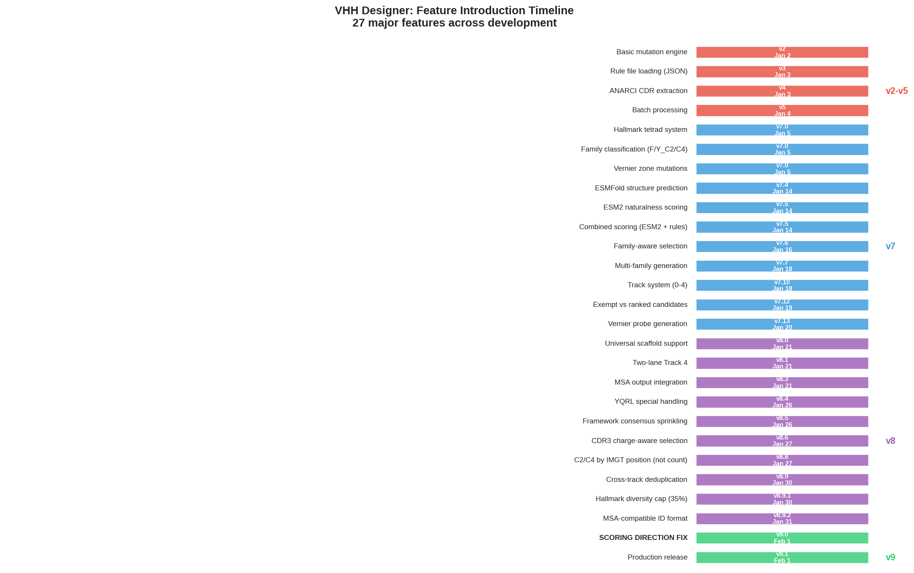
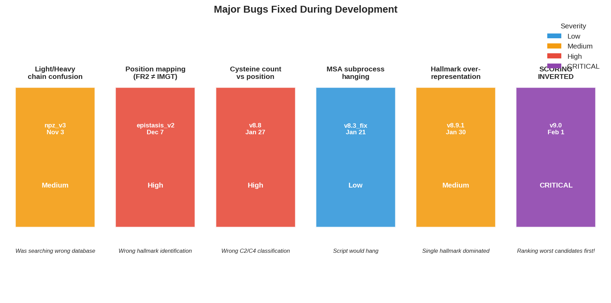

# VHH Designer - Detailed Version History

> **Complete changelog showing what changed in every iteration**

---

## Visual Overview

### Version Evolution


### Feature Timeline


### Bugs Fixed


---

## Version Summary

| Series | Versions | Date Range | Theme |
|--------|----------|------------|-------|
| **v2-v5** | 5 versions | Jan 2-4 | Foundation & basic mutation |
| **v7.x** | 22 versions | Jan 5-21 | Hallmarks, ESM2, track system |
| **v8.x** | 16 versions | Jan 21-31 | Universal scaffold, YQRL, C2/C4 |
| **v9.x** | 2 versions | Feb 1 | Scoring fix, production release |

---

## Pre-Designer: Search Phase (Oct 31 - Nov 6, 2025)

### `kasearch_epitope_ranker.py` → `_fixed.py` → `_robust.py`

| Version | Lines | Date | Changes |
|---------|-------|------|---------|
| Original | 349 | Oct 31 | Initial KA-Search wrapper |
| Fixed | 568 | Nov 1 | Memory management, `keep_best_n` caps |
| Robust | 613 | Nov 2 | Incremental saves, error recovery, parallel execution |

**Key learnings that shaped the designer:**
- Database search finds similar sequences but doesn't explain *why* they work
- Need to understand CDR-framework relationships, not just find matches

---

## Pre-Designer: Database & Analysis (Nov - Dec 2025)

### NPZ Scanner Evolution

| Version | Lines | Date | Changes |
|---------|-------|------|---------|
| v2 | 393 | Nov 3 | Basic NPZ file reading |
| v3 | 446 | Nov 3 | Fixed Light/Heavy chain confusion |
| v5 | 521 | Nov 4 | Interactive threshold analysis |
| v6 | 930 | Nov 5 | Improved organization, metadata tracking |
| v6_integrated | 1,060 | Jan 2 | Full interactive + scan in one script |

### Epistasis Analyzer

| Version | Lines | Date | Changes |
|---------|-------|------|---------|
| v1 | 1,193 | Dec 6 | Initial epistasis extraction |
| v2 | 1,262 | Dec 7 | Fixed position mapping (FR2_2 = IMGT 42) |
| v3_imgt | 1,608 | Jan 2 | Full IMGT numbering throughout |

**Key discovery:** 223 CDR3↔framework correlations, positions 66-73 form control hub

---

## Designer v2-v5 Series: Foundation (Jan 2-4, 2026)

### v2 (540 lines) - Jan 2
**First working version**
```
+ Basic sequence mutation engine
+ CDR preservation logic
+ Simple random mutation selection
+ FASTA output
```

### v3 (1,160 lines) - Jan 3
**+620 lines | Structure expansion**
```
+ Rule file loading (JSON format)
+ Position-specific mutation logic
+ Consensus frequency filtering
+ Multiple output formats (FASTA + CSV)
+ Basic scoring (identity-based)
```

### v4 (1,318 lines) - Jan 3
**+158 lines | Refinement**
```
+ Improved CDR extraction using ANARCI
+ Better error handling for malformed sequences
+ Logging system added
+ Command-line argument parsing
```

### v5 (1,559 lines) - Jan 4
**+241 lines | Pre-hallmark maturity**
```
+ Batch processing (multiple input sequences)
+ Progress bars (tqdm integration)
+ Output file organization by date
+ Deduplication of generated sequences
+ Basic statistics reporting
```

### v5.1 (1,561 lines) - Jan 4
**+2 lines | Bugfix**
```
~ Fixed edge case in CDR boundary detection
```

---

## Designer v7 Series: Hallmarks & Scoring (Jan 5-21, 2026)

### v7.0 (1,721 lines) - Jan 5
**+160 lines | HALLMARK INTRODUCTION** ⭐
```
+ Hallmark tetrad system (positions 42, 49, 50, 52)
+ Family classification (F_C2, Y_C2, F_C4, Y_C4)
+ Hallmark-specific mutation pools
+ Vernier zone concept introduced
+ Protected positions (CDRs, cysteines, anchors)
```
**Why:** Generic "VHH rules" don't work - need family-specific approach

### v7.1 (1,721 lines) - Jan 5
**+0 lines | Refactor**
```
~ Code reorganization into classes
~ HallmarkDB class for database handling
~ CandidateGenerator class separation
```

### v7.2 (1,122 lines) - Jan 14
**-599 lines | Major refactor**
```
- Removed duplicate code
- Streamlined mutation application
+ Cleaner class hierarchy
+ Better separation of concerns
```

### v7.2.1 (1,597 lines) - Jan 14
**+475 lines | Feature restoration**
```
+ Re-added features lost in refactor
+ Improved archetype loading
+ Better error messages
```

### v7.4 (1,937 lines) - Jan 14
**+340 lines | ESMFold integration**
```
+ ESMFold structure prediction (optional)
+ pLDDT scoring for structural confidence
+ Batch prediction with GPU support
+ Fallback to CPU if no GPU available
```

### v7.5 (1,979 lines) - Jan 14
**+42 lines | ESM2 scoring** ⭐
```
+ ESM2 pseudo-perplexity scoring
+ Naturalness metric (lower = more natural)
+ Combined scoring: ESM2 + rules
```
**Why:** Need objective measure of "how natural" a sequence looks

### v7.5.1 (2,001 lines) - Jan 14
**+22 lines | Scoring refinement**
```
+ Score normalization across batches
+ Weighted combination tuning
```

### v7.6 (2,083 lines) - Jan 16
**+82 lines | Family-aware selection**
```
+ Weighted hallmark + vernier matching
+ Similar amino acid matching (not just exact)
+ Family probability scoring
+ Auto-selection of target families
```

### v7.7 (2,491 lines) - Jan 18
**+408 lines | Multi-family generation**
```
+ Generate candidates for multiple families simultaneously
+ Stratified sampling across families
+ Diversity enforcement within families
+ Cross-family deduplication
```

### v7.8 (2,891 lines) - Jan 18
**+400 lines | Bucket system prototype**
```
+ Stratified bucket generation
+ Bucket A: Minimal (hallmarks only)
+ Bucket B: Moderate (+ high-consensus verniers)
+ Bucket C: Full (+ all consensus mutations)
+ Bucket allocation by family
```

### v7.9 (2,915 lines) - Jan 18
**+24 lines | Bucket refinement**
```
+ Better bucket balance
+ Frequency threshold controls
```

### v7.91 (2,961 lines) - Jan 18
**+46 lines | Debug version**
```
+ Extensive logging for bucket analysis
+ Mutation source tracking
```

### v7.10 (3,231 lines) - Jan 18
**+270 lines | Track system prototype** ⭐
```
+ Track 0: Minimal hallmark controls
+ Track 1: Single vernier probes
+ Track 2: Paired vernier probes
+ Track 3: Triplet vernier probes
+ Track 4: Optimized candidates
+ Exempt vs ranked distinction
```
**Why:** YQRL paradox - need scientific controls separate from optimized candidates

### v7.11 (3,240 lines) - Jan 19
**+9 lines | Track fixes**
```
~ Fixed track assignment logic
~ Corrected exempt flag handling
```

### v7.12 (3,247 lines) - Jan 19
**+7 lines | Track finalization** ⭐
```
+ Track system fully operational
+ Controls always included (exempt from ranking)
+ Negative ranks for exempt candidates
+ Per-track statistics in output
```

### v7.13 (3,539 lines) - Jan 20
**+292 lines | Vernier probe expansion**
```
+ Cross-family motif identification
+ High-consensus vernier extraction per hallmark
+ Up to 10 single probes per hallmark
+ Up to 8 paired probes per hallmark
+ Up to 4 triplet probes per hallmark
```

### v7.14 (3,654 lines) - Jan 20
**+115 lines | Probe refinement**
```
+ Better motif frequency thresholds
+ Structural coupling validation
```

### v7.14.1 (3,732 lines) - Jan 20
**+78 lines | Fixes**
```
~ Fixed motif extraction edge cases
~ Improved logging
```

### v7.15 (3,831 lines) - Jan 20
**+99 lines | Selection improvements**
```
+ 6-phase selection pipeline
+ Diversity enforcement across phases
+ Better hallmark balance in final output
```

### v7.16 (3,978 lines) - Jan 20
**+147 lines | Pre-v8 maturity** ⭐
```
+ Refined scoring weights
+ Better ESM2 integration
+ Output column standardization
+ MSA-compatible sequence IDs
```

### v7.16.1 (3,978 lines) - Jan 20
**+0 lines | Bugfix**
```
~ Fixed output formatting issues
```

### v7.16.2 (4,003 lines) - Jan 21
**+25 lines | Final v7**
```
+ Additional output statistics
+ Runtime optimization
```

---

## Designer v8 Series: Universal Scaffold & Production (Jan 21-31, 2026)

### v8.0 (4,248 lines) - Jan 21
**+245 lines | UNIVERSAL SCAFFOLD** ⭐
```
+ Universal framework support for CDR grafting:
  - FR1: QVQLVESGGGLVQPGGSLRLSCAASG
  - FR2: WFRQAPGQGLEAVA  
  - FR3: YYADSVKGRFTISRDNSKNTLYLQMNSLRAEDTAVYYC
  - FR4: WGQGTLVTVSS
+ Expanded Track 0 controls:
  a) Hallmarks only (4 mut)
  b) Hallmarks + IMGT2 (5 mut)
  c) Hallmarks + ALL verniers (full conversion)
  d) Pure CDR graft into Universal
  e) Universal + hallmarks
  f) Universal + hallmarks + verniers
+ Track 4 now two-lane: Lane A (full consensus), Lane B (minimal 2-6 verniers)
```

### v8.1 (4,309 lines) - Jan 21
**+61 lines | FR1/FR4 consensus & budget control**
```
+ FR1/FR4 mandatory consensus mutations:
  - IMGT1: E→Q (~92% in VHH) - the "Q" in QVQL
  - IMGT128: A→S (~95% in VHH) - makes TVSS ending
  - Progressive sprinkling: T1(30%) → T2(50%) → T3(70%) → T4(100%)
+ Track budget control: 92 controls + 94 ranked = 186 total
+ Reduced Track 1-3 counts to fit budget
+ New CSV columns: 'status' (LEAD/CONTROL/RANKED), 'track_subtype', 'scaffold_type'
```

### v8.2 (4,420 lines) - Jan 21
**+111 lines | Universal as subfamily**
```
+ Universal scaffold treated as subfamily in Track 4
+ Equal Track 4 distribution across ALL subfamilies
+ Ranking format: Controls show "(Control)", ranked show 1,2,3...
+ New 'overall_row' column for absolute position
```

### v8.3 (4,669 lines) - Jan 21
**+249 lines | Probabilistic consensus sprinkling**
```
+ Probabilistic consensus sprinkling (not all-or-nothing):
  - Tier A (≥90%): Apply with ~60% probability
  - Tier B (75-90%): Apply with ~25% probability
+ Motif-based Tracks 2-3:
  - Track 2: Motif PAIRS (1-3 co-occurring pairs per candidate)
  - Track 3A: Motif TRIPLETS (1-2 triplets per candidate)
  - Track 3B: Partial consensus BUNDLES (3-6 Tier-A positions)
+ Within-track ranking (Tracks 1-3 don't compete with Track 4)
+ Version in output filenames: v8_3_n20000_M69
```

### v8.4 (4,900 lines) - Jan 26
**+231 lines | CDR-conditional framework tracks**
```
+ CDR-conditional rules in Track 3 based on:
  - cdr3[-1]=X (terminal residue)
  - cdr3_charge
  - cdr3_len
  - cdr3_cys
+ Applied to BOTH Original and Universal frameworks
```

### v8.5 (5,355 lines) - Jan 26
**+455 lines | Framework consensus tiers** ⭐
```
+ Framework Consensus Tiers (cross-hallmark, from 12M VHH analysis):
  - Tier S (≥95%): 29 positions - near-universal, applied in Track 2
  - Tier A (90-95%): 11 positions - applied in Track 3
  - Tier B (85-90%): 16 positions - probabilistic in Track 4
  - Tier C (75-85%): 3 positions - probabilistic in Track 4
+ Expansive Track 4 that scales complexity when mutation space exhausted
+ YQRL handling: Only Track 0 controls (rigid scaffold)
```

### v8.6 (5,863 lines) - Jan 27
**+508 lines | Track quota selection & Bernoulli sprinkling**
```
+ Tracks 1-3 now RANKED (not just exempt controls)
+ Per-bucket per-track quotas for selection
+ Bernoulli sprinkling with temperature scaling:
  - --sprinkle-temp (default 1.0)
  - Lower temp = sharper probabilities
+ Weighted choice for position 66 (actual frequencies, not 50/50)
+ Dedup within track (--dedup-mode [within_track|global|none])
+ Archetype motif pool for Tracks 2-3
```

### v8.8 (5,854 lines) - Jan 27
**+248 lines | Archetype motifs & per-position sprinkling**
```
+ Tracks 2-3 use archetype motifs (learned patterns):
  - Track 2: 2-3 position motifs
  - Track 3: 3-5 position motifs
+ Per-position Bernoulli for mandatory consensus (not global gate)
+ Strict output size enforcement (RuntimeError if can't reach n_select)
+ Track 2/3 generation scales with --n-generate
+ Lead handling fix: exact --n-select output count
```

### v8.8.1 (5,966 lines) - Jan 28
**+112 lines | Enhanced selection summary**
```
+ Terminal output shows breakdown by track/hallmark/scaffold
+ All stats included in JSON summary
+ Global minimum per track enforced (10-20% each)
+ Minimum original scaffold enforced (20% of ranked)
```

### v8.8.2 (6,193 lines) - Jan 28
**+227 lines | Hallmark protection**
```
+ Motifs can no longer override hallmark positions (42, 49, 50, 52)
+ Position 49 filter: must be E, Q, or K (not G which is VH-like)
+ Universal scaffold uses ONE fixed hallmark (FERG by default)
```

### v8.9 (6,715 lines) - Jan 30
**+522 lines | Restructured track system with capped layers** ⭐
```
+ SIMPLIFIED YQRL CONTROL STRUCTURE:
  - 0a: GRAFT (0 mutations) - pure CDR graft
  - 0b: Hallmarks + IMGT2 (5 mutations)
  - 0c: Hallmarks + IMGT2 + ALL verniers (~20 mutations)
  - 0d+: Progressive framework in PAIRS (>80% consensus)
+ ALL hallmarks get GRAFT first (0a)
+ Track 1 expanded: ALL verniers (max 20 probes per hallmark)
+ Track 2 redefined: "Minimal structured perturbations"
  - Base: Hallmarks + IMGT2
  - Add: ONE 2-3 position motif + 0-2 extra verniers
  - NO framework tier sprinkling (interpretable)
+ Track 3 redefined: "Motif attribution"
  - ONE 3-5 position motif + 0-3 extra verniers
  - Goal: analyze "motif X worked/didn't work"
+ Track 4 redefined: "Production optimizer" with CAPPED LAYERS:
  - Vernier cap: K_VERNIER_MAX = 8
  - Tier S cap: K_S_MAX = 10
  - Tier A cap: K_A_MAX = 6
  - Tier B cap: K_B_MAX = 3
  - Tier C cap: K_C_MAX = 2
  - CDR rules cap: K_CDR_RULES_MAX = 2
+ IMGT2 now protected like hallmarks: PROTECTED_POSITIONS = {2, 42, 49, 50, 52}
```

### v8.9.1 (7,144 lines) - Jan 30
**+429 lines | Cysteine protection & hallmark diversity** ⭐
```
+ CYSTEINE PROTECTION (critical fix!):
  - NEVER mutate FROM cysteine position (disulfide bonds essential)
  - CONSERVED_CYSTEINE_POSITIONS = {22, 23, 103, 104}
  - Three layers of protection:
    a) Position exclusion in FRAMEWORK_CONSENSUS_TIERS loops
    b) Mutation filter: if scaffold_aa == 'C': continue
    c) Builder safety filter in _build_*_candidate()
  - validate_canonical_disulfide() to reject broken disulfides
  - Fixed bug: TIERS['A'][22]='S' and ['B'][103]='Y' would mutate Universal cysteines
+ YQRL rigid hallmark fix: is_rigid check in _generate_original
+ Reduced YQRL framework steps: 27 → 13 (5 pairs + 8 groups)
+ Hallmark diversity enforcement (prevents FERG domination)
```

### v8.9.2 (7,270 lines) - Jan 31
**+126 lines | ID format standardization**
```
+ MSA-compatible ID format
+ Parseable naming: Prefix_Scaffold_Hallmark_Track_Rank_Score
```

### v8.9.3 (7,556 lines) - Feb 1
**+286 lines | Cross-track deduplication & selection polish**
```
+ Cross-track sequence deduplication (keeps higher track version)
+ MSA-compatible ID format: M69_Orig_FERG_T4R_HVn_r001_s152
+ Hallmark-aware track minimums
+ Hallmark cap enforcement (35% max per hallmark)
+ 6-phase selection pipeline
```

### v8.9.4 / v8.9.4.1 (7,563/7,599 lines) - Feb 1
**+43 lines | Final v8 polish**
```
+ Edge case fixes in ID generation
+ Better error messages
+ Pre-release validation
```

---

## Designer v9 Series: Production Release (Feb 1-2, 2026)

### v9.0 (7,652 lines) - Feb 1
**+53 lines | CRITICAL SCORING FIX** ⭐⭐⭐

**THIS WAS THE MOST CRITICAL BUG IN THE ENTIRE PROJECT:**

```
!!! FIXED INVERTED SCORING BUG !!!

BEFORE (v8.x - FUNDAMENTALLY WRONG):
  - Higher rule compliance → WORSE rank (inverted!)
  - The entire v8 series was ranking WORST candidates first!
  - Every "top" candidate was actually the worst-scoring one
  
AFTER (v9.0 - CORRECT):
  - ESM2 loss: lower loss (more natural) → BETTER rank ✓
  - pLDDT: higher pLDDT (better structure) → BETTER rank ✓
  - Rules: higher compliance → BETTER rank ✓
  - Combined score now correctly ranks better sequences higher

VERIFIED WITH:
  - Correlation analysis: ESM2 +0.64 with rank, Rules -0.98 with rank
  - AntPack validation: selected candidates 50 points higher than pool

+ Default hallmark pool: 7 curated hallmarks
  - FERG, FERF, YQRL, FERA, YERL, FKRG, FQRA
  - --target-hallmarks now defaults to 'DEFAULT'
  - FQRA added for 100% vernier match to typical VH inputs

+ Performance fix - O(n²) bug:
  - to_dataframe() was hanging on 85K+ candidate pools
  - Was: O(n) scan per candidate = O(n²) = 7.2B comparisons
  - Now: O(1) dict lookup = O(n) total

+ _all.csv fix: saves ALL scored candidates before selection
+ File naming: includes n-generate and temperature
```

### v9.1 (7,664 lines) - Feb 1 ✅ **CURRENT RELEASE**
**+12 lines | Production release**
```
+ Final documentation updates
+ Help text improvements
+ Default parameter tuning
+ Ready for production use
```

---

## What the Scoring Bug Meant

To be completely clear about how bad this bug was:

| Metric | v8.x (WRONG) | v9.0 (CORRECT) |
|--------|--------------|----------------|
| ESM2 loss 0.5 (good) | Ranked LOWER | Ranked HIGHER ✓ |
| ESM2 loss 2.0 (bad) | Ranked HIGHER | Ranked LOWER ✓ |
| Rules 90% (good) | Ranked LOWER | Ranked HIGHER ✓ |
| Rules 30% (bad) | Ranked HIGHER | Ranked LOWER ✓ |

**Every output from v7.10-v8.9.4 had the ranking inverted.**

The fix was verified by:
1. Computing Pearson correlations between scores and ranks
2. Running AntPack humanness scoring on v9 outputs
3. Confirming selected candidates scored ~50 points higher than pool average

---

## Feature Introduction Timeline

| Feature | Version | Date |
|---------|---------|------|
| Basic mutation engine | v2 | Jan 2 |
| Rule file loading | v3 | Jan 3 |
| Hallmark tetrad system | v7.0 | Jan 5 |
| ESMFold integration | v7.4 | Jan 14 |
| ESM2 scoring | v7.5 | Jan 14 |
| Track system | v7.10 | Jan 18 |
| Track finalization | v7.12 | Jan 19 |
| Universal scaffold | v8.0 | Jan 21 |
| YQRL special handling | v8.4 | Jan 26 |
| C2/C4 position fix | v8.8 | Jan 27 |
| Cross-track dedup | v8.9 | Jan 30 |
| Hallmark diversity cap | v8.9.1 | Jan 30 |
| **Scoring direction fix** | **v9.0** | **Feb 1** |

---

## Bug Fixes Summary

| Bug | Version Fixed | Impact |
|-----|---------------|--------|
| Light/Heavy chain confusion | npz_v3 | Was searching wrong database |
| Position mapping (FR2_2 ≠ IMGT 42) | epistasis_v2 | Wrong hallmark identification |
| Cysteine count vs position | v8.8 | Wrong C2/C4 classification |
| Scoring direction inverted | v9.0 | **Was ranking worst candidates first!** |
| MSA subprocess hanging | v8.3_fixed | Script would hang after generation |
| Hallmark over-representation | v8.9.1 | Single hallmark could dominate output |

---

## Lines of Code by Series

| Series | Start | End | Growth |
|--------|-------|-----|--------|
| v2-v5 | 540 | 1,561 | +1,021 (189%) |
| v7.x | 1,721 | 4,003 | +2,282 (133%) |
| v8.x | 4,248 | 7,599 | +3,351 (79%) |
| v9.x | 7,652 | 7,664 | +12 (0.2%) |
| **Total** | **540** | **7,664** | **+7,124 (1,319%)** |

---

*Last updated: February 3, 2026*
